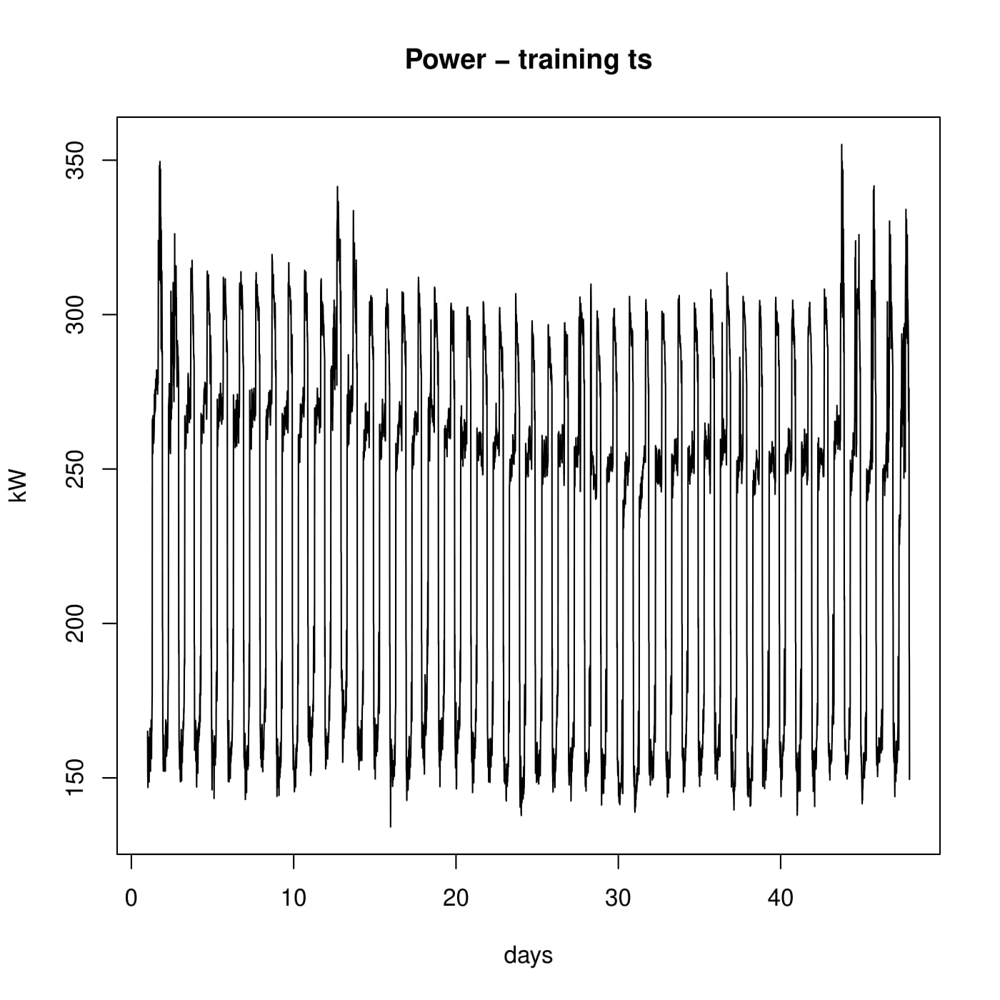
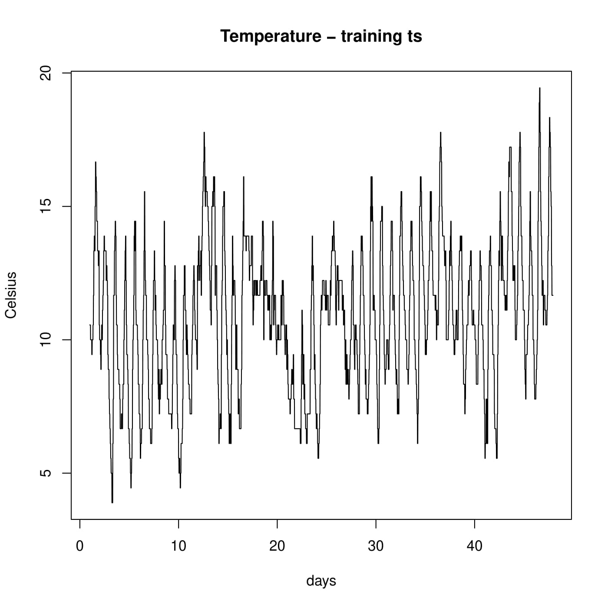
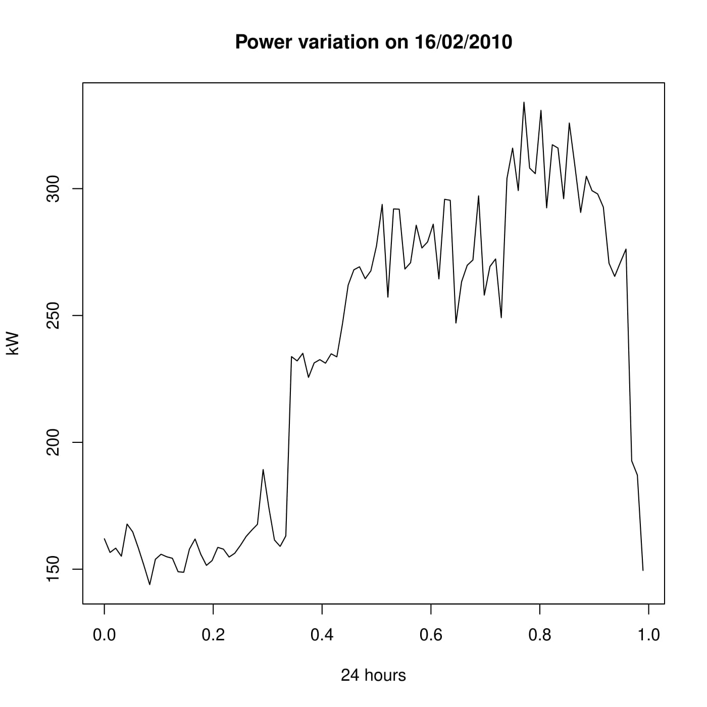
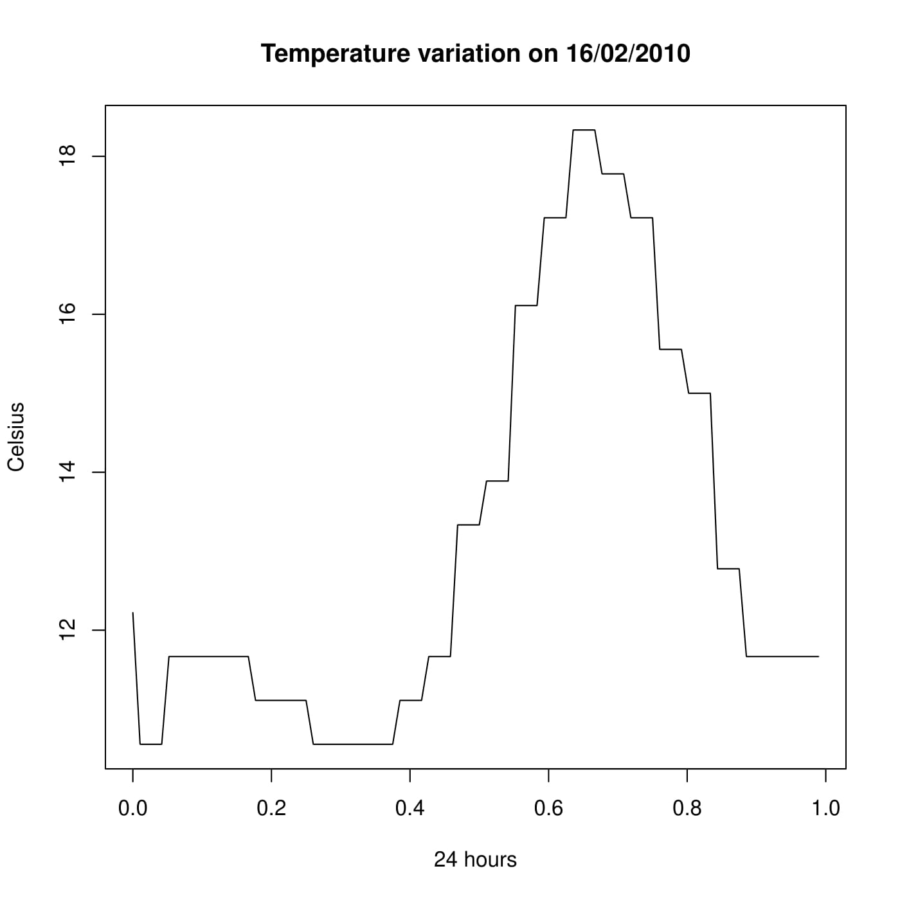
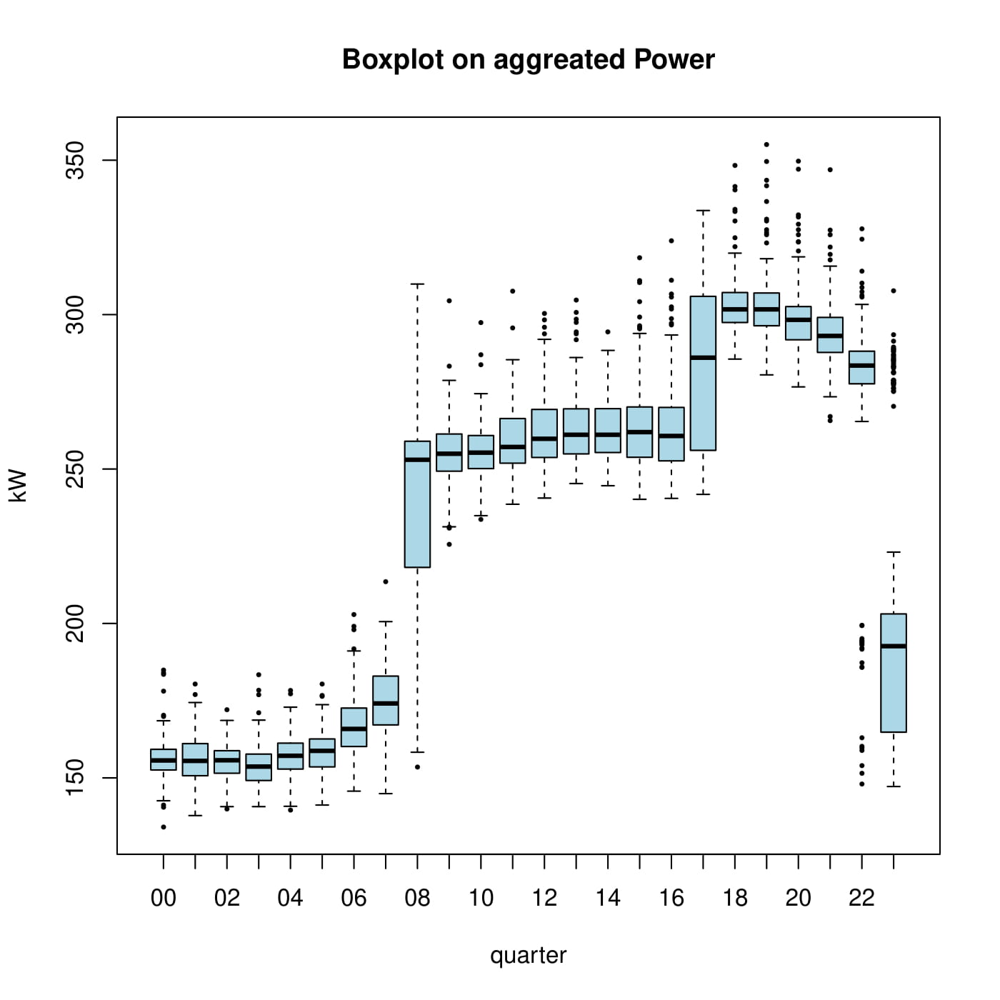
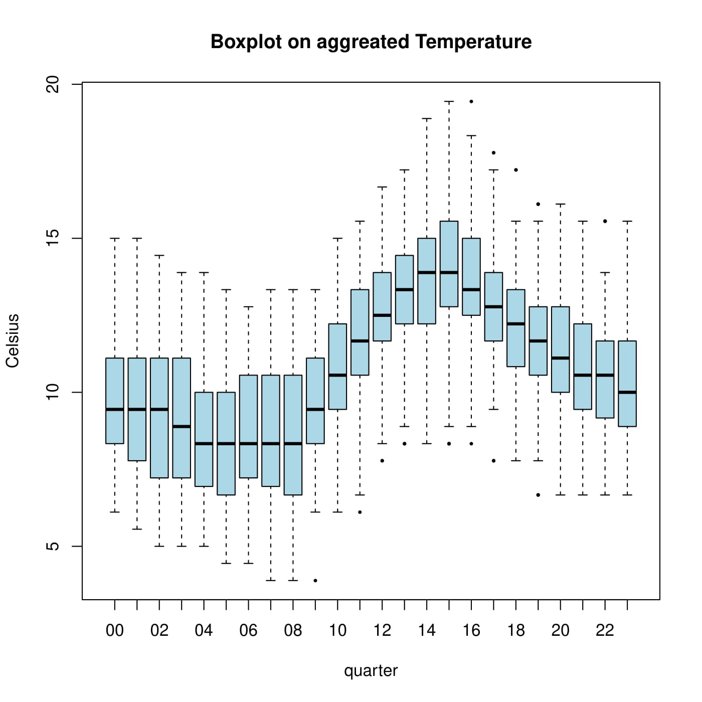
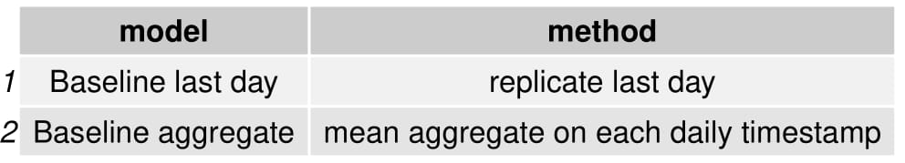
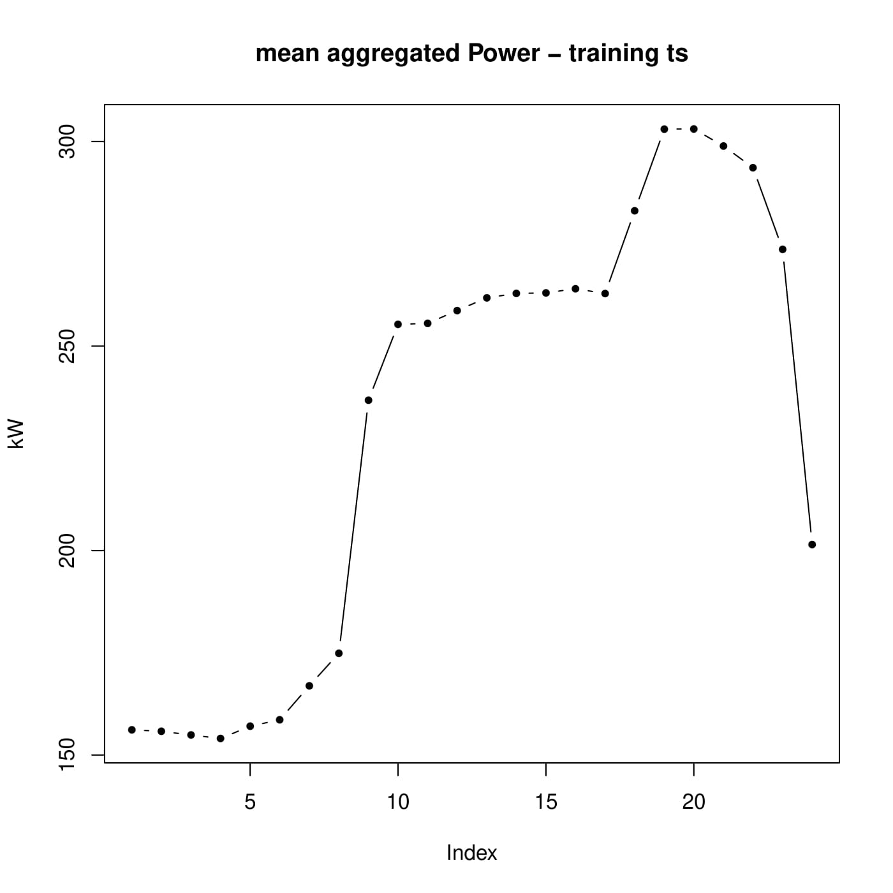
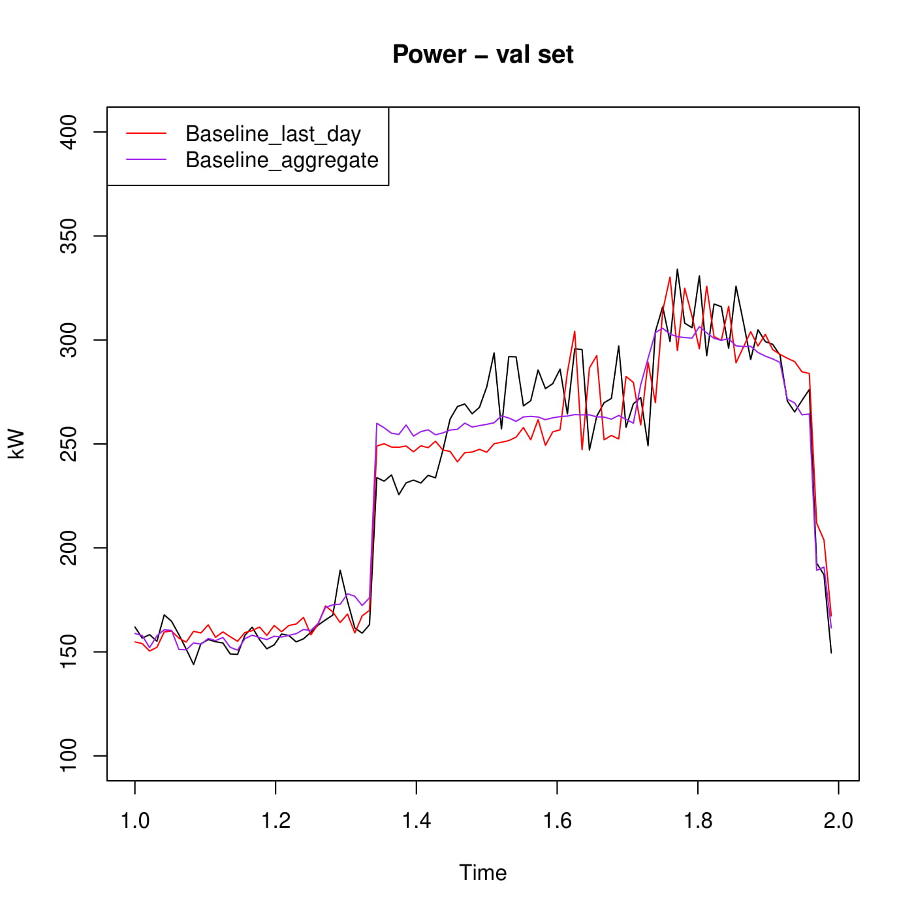
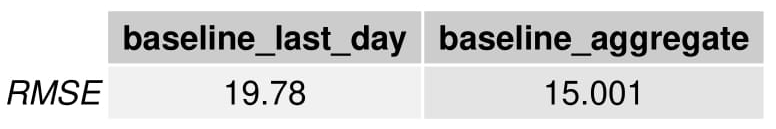

# Power Consumption Forecasting

## Goal

Given two historics of measures produced by a sensor which performs **96 daily measures**:
- **power consumption** from 01/01/2010 to 16/02/2010
- **temperature** from 01/01/2010 to 17/02/2010

we had to **forecast** power consumption on the 17/02/2010.

## Exploratory Data Analysis

We took **46 days as training set** and **1 day as validation set**, measures of the 16/02/2010. Taking 1 day of data as validation may be a bit suspicious, probably 2 days would have been better. Nevertheless our idea was that since we only had to forecast one day, that is 96 measures of the same day, we should take a validation set which would most likely look similar as the test set.  

  
   
  
   

We observe that both time series have **seasonality**. Although power consumption time series does not have **trend** while temperature time series has a slight trend.

  
   

On **boxplots** we notice that for power consumption most of the measures on a day have low variance. Measures near 8 am and 5 pm have high variance though. It could be expected since it is when the people leave and go back home. In the contrary in the case of temperature we notice high variance for each measure of the day. Indeed temperature cannot be explained only by trend and seasonality. 

## Baseline models

  

The second baseline model looks like the following (alhough here it has been aggregated over hours instead of daily measures):

  

On validation set we get the following forecasts:

  

On validation set we get the following results:

  

## Linear Regression models

## Exponential models

## ARIMA model

## NNAR model

